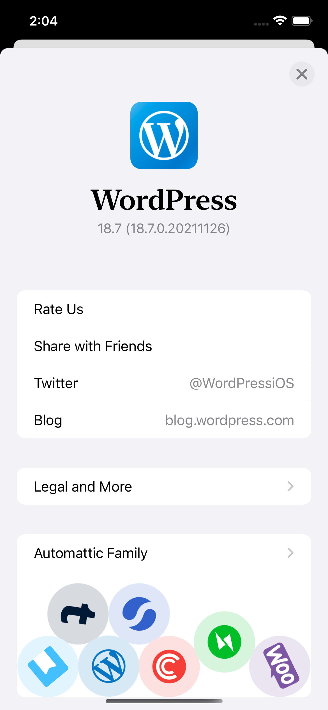

# AutomatticAbout

This package provides classes that can be used to show an About screen in a host app, such as this example from WordPress for iOS:



Host apps must provide an `AboutScreenConfiguration`, which specifies the structure and behavior of the about screen. For a real world example, check out the [configuration for WordPress for iOS](https://github.com/wordpress-mobile/WordPress-iOS/blob/develop/WordPress/Classes/ViewRelated/Me/App%20Settings/About/AppAboutScreenConfiguration.swift). Apps should also provide an `AboutScreenAppInfo` instance, containing the app's icon, title, and version to be displayed in the header of the about screen.

The [`AboutScreenConfiguration` protocol](https://github.com/Automattic/AutomatticAbout-Swift/blob/main/Sources/AutomatticAbout/AboutScreenConfiguration.swift) contains an array of `sections` describing each section within the screen. Each of those is itself an array of `AboutItem`s, which can have titles, subtitles, cell styles, an action, and more.

Here's an example configuration: 

```swift
struct AppAboutScreenConfiguration: AboutScreenConfiguration {
    var sections: [AboutScreenSection] {
        [
            [
                AboutItem(title: "Automattic", subtitle: "Our website", cellStyle: .subtitle, action: { context in
                    // Perform an action, such as...
                    let vc = SFSafariViewController(url: URL(string: "https://automattic.com")!)
                    context.viewController.present(vc, animated: true, completion: nil)
                })
            ],
            [
                AboutItem(title: "Our Apps", accessoryType: .disclosureIndicator, hidesSeparator: true, action: { context in
                    let vc = SFSafariViewController(url: URL(string: "https://example.com")!)
                    context.viewController.present(vc, animated: true, completion: nil)
                }),
                AboutItem(title: "", cellStyle: .appLogos)
            ]
        ]
    }

    func dismissScreen(_ actionContext: AboutItemActionContext) {
        actionContext.viewController.presentingViewController?.dismiss(animated: true)
        // Optionally perform an action, for example...
        WPAnalytics.track(.aboutScreenDismiss)
    }

    func willShow(viewController: UIViewController) {

    }

    func didHide(viewController: UIViewController) {

    }
    
    static var appInfo: AboutScreenAppInfo {
        AboutScreenAppInfo(name: (Bundle.main.object(forInfoDictionaryKey: "CFBundleDisplayName") as? String) ?? "",
                           version: Bundle.main.shortVersionString,
                           icon: fetch the app's icon here)
    }
}
```

And here's an example of displaying an about screen using the above configuration:

```
    let configuration = AppAboutScreenConfiguration()
    let controller = AutomatticAboutScreen.controller(appInfo: AppAboutScreenConfiguration.appInfo,
                                                      configuration: configuration)
    present(controller, animated: true) {
        self.tableView.deselectSelectedRow(animated: true)
    }
```
